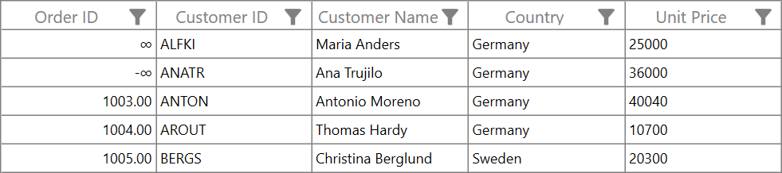

# How to display positive and negative infinity values in GridNumericColumn WPF DataGrid

[WPF DataGrid](https://www.syncfusion.com/wpf-controls/datagrid) (SfDataGrid) does not provide direct support to display the infinity symbol in [GridNumericColumn](https://help.syncfusion.com/cr/wpf/Syncfusion.UI.Xaml.Grid.GridNumericColumn.html). You can display the infinity symbol with a `GridNumericColumn` can be accomplished by overriding the [GridCellNumericRenderer](https://help.syncfusion.com/cr/wpf/Syncfusion.UI.Xaml.Grid.Cells.GridCellNumericRenderer.html) and customizing the [OnInitializeEditElement](https://help.syncfusion.com/cr/wpf/Syncfusion.UI.Xaml.Grid.Cells.GridCellNumericRenderer.html#Syncfusion_UI_Xaml_Grid_Cells_GridCellNumericRenderer_OnInitializeEditElement_Syncfusion_UI_Xaml_Grid_DataColumnBase_Syncfusion_Windows_Shared_DoubleTextBox_System_Object_) and [OnInitializeDisplayElement](https://help.syncfusion.com/cr/wpf/Syncfusion.UI.Xaml.Grid.Cells.GridCellNumericRenderer.html#Syncfusion_UI_Xaml_Grid_Cells_GridCellNumericRenderer_OnInitializeDisplayElement_Syncfusion_UI_Xaml_Grid_DataColumnBase_System_Windows_Controls_TextBlock_System_Object_) methods.
 
 ```C#
//Remove the default numeric cell renderer
this.sfDataGrid.CellRenderers.Remove("Numeric");

// Add the custom numeric cell renderer
this.sfDataGrid.CellRenderers.Add("Numeric", new GridCellNumericRendererExt());
 

//Custom numeric cell renderer
public class GridCellNumericRendererExt : GridCellNumericRenderer
{

     // Override the OnInitializeDisplayElement method
     public override void OnInitializeDisplayElement(DataColumnBase dataColumn, TextBlock uiElement, object dataContext)
     {

         base.OnInitializeDisplayElement(dataColumn, uiElement, dataContext);
         // Get the value from the datacontext
         var value = (double)dataContext.GetType().GetProperty(dataColumn.GridColumn.MappingName).GetValue(dataContext, null);

         // Check whether the value is infinity or not
         if (double.IsInfinity(value))
         {
             // Set the text as infinity
             uiElement.Text = value.ToString();
         }
     }    

     // Override the OnInitializeEditElement method
     public override void OnInitializeEditElement(DataColumnBase dataColumn, DoubleTextBox uiElement, object dataContext)
     {
         base.OnInitializeEditElement(dataColumn, uiElement, dataContext);
         
         // Get the value from the datacontext
         var value = (double)dataContext.GetType().GetProperty(dataColumn.GridColumn.MappingName).GetValue(dataContext, null);

         // Check whether the value is infinity or not
         if (double.IsInfinity(value))
         {
             // Set the max and min values as infinity
             uiElement.MaxValue = double.PositiveInfinity;
             uiElement.MinValue = double.NegativeInfinity;
         }
     }
}
 ```

The screenshot below illustrates the positive and negative infinity values displayed in `GridNumericColumn`,
 
 
 
Take a moment to peruse the [WPF DataGrid - Customize Column Renderer](https://help.syncfusion.com/wpf/datagrid/column-types#customize-column-renderer) documentation, where you can find about customize column renderer with code examples.